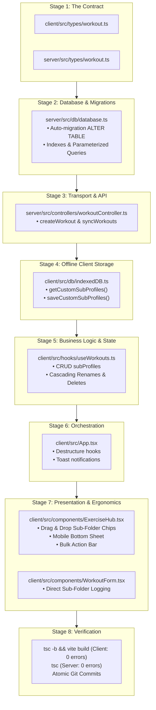

# The Full-Stack Architecture Change Playbook
## *How to Methodically Implement Big Features from Database to UI Without Bugs, Mess, or Headaches*

> **Target Audience:** Junior Software Engineers, Pair Programmers, and developers looking to understand production-grade system architecture, data-flow discipline, and methodical full-stack implementation.

---

## 📑 Table of Contents
1. [The Mindset Shift: Newbie Chaos vs. Senior Method](#1-the-mindset-shift-newbie-chaos-vs-senior-method)
2. [The 8-Stage Feature Pipeline (Visual Flowchart)](#2-the-8-stage-feature-pipeline-visual-flowchart)
3. [Case Study: Implementing Sub-Folder Groupings](#3-case-study-implementing-sub-folder-groupings)
   - [Stage 1: The Contract (Domain Types)](#stage-1-the-contract-domain-types)
   - [Stage 2: Persistent Storage & Migrations (SQLite)](#stage-2-persistent-storage--migrations-sqlite)
   - [Stage 3: Network API & Sync Transport (Express)](#stage-3-network-api--sync-transport-express)
   - [Stage 4: Client Offline Storage (IndexedDB)](#stage-4-client-offline-storage-indexeddb)
   - [Stage 5: State Management & Business Rules (React Hooks)](#stage-5-state-management--business-rules-react-hooks)
   - [Stage 6: Root Orchestration & Routing (`App.tsx`)](#stage-6-root-orchestration--routing-apptsx)
   - [Stage 7: Presentation, Mobile Touch & UX (`ExerciseHub` & `WorkoutForm`)](#stage-7-presentation-mobile-touch--ux-exercisehub--workoutform)
   - [Stage 8: Compilation, Guardrails & Git Discipline](#stage-8-compilation-guardrails--git-discipline)
4. [The Junior SWE Universal Checklist (Cheat Sheet for Real Jobs)](#4-the-junior-swe-universal-checklist-cheat-sheet-for-real-jobs)
5. [Top 5 Traps That Break Production (And How to Prevent Them)](#5-top-5-traps-that-break-production-and-how-to-prevent-them)

---

## 1. The Mindset Shift: Newbie Chaos vs. Senior Method

When a tech lead or employer says:  
> *"Allow users to create nested sub-folders inside their workout profiles, drag exercises into them, and filter by section."*

Here is how two different engineers approach the task:

### ❌ The "Outside-In" Trap (The Newbie Way)
```
[1. Open UI Component] ──> [2. Hack in a button & state] ──> [3. Realize backend rejects it]
                                                                      │
[6. Hundreds of TypeScript red squiggles] <── [5. Crash on existing data] <── [4. Manually hack DB]
```
1. **Starts in the UI**: Opens `ExerciseHub.tsx` and starts building buttons, input boxes, and state variables (`const [subFolder, setSubFolder] = useState()`).
2. **Hacks Local State**: Realizes the data is lost on page reload.
3. **Touches the Backend Hastily**: Adds a column to the database without a migration, causing existing records to throw `NULL` or syntax errors.
4. **Breaks Offline Sync**: Existing synced records in IndexedDB don't have the field, causing sync crashes.
5. **Compiler Chaos**: TypeScript throws 40+ errors across 12 files because interfaces were never updated.
6. **Result**: Frustration, broken git branches, late delivery, and bugs in production.

---

### ✅ The "Inside-Out / Data-First" Discipline (The Senior Way)
```
[1. Type Contract] ──> [2. DB Migration] ──> [3. API Sync] ──> [4. Local Cache]
                                                                        │
[8. Safe Git Push] <── [7. UI / Touch UX] <── [6. Root Wiring] <── [5. Domain Hook]
```
1. **Model the Domain First**: Define the single source of truth in TypeScript interfaces.
2. **Secure Persistent Storage**: Write non-destructive database migrations with defaults so existing user data is never corrupted.
3. **Update API & Transport**: Enable the network controllers to serialize and deserialize the new field.
4. **Update Offline Cache**: Ensure local databases (IndexedDB) store and retrieve the new field.
5. **Implement Business Logic**: Write isolated, testable hooks handling creation, renaming, cascading deletions, and state memoization.
6. **Orchestrate Root State**: Pass handlers down cleanly.
7. **Build Presentation Layer**: Design desktop drag-and-drop, mobile touch events, and 1-tap accessible fallbacks.
8. **Compiler & Bundler Verification**: Let TypeScript prove that zero contracts are broken before committing.

> 💡 **Golden Rule for Junior SWEs:**  
> *Never write a single line of JSX/HTML until your data types, database migration, and state layer are compiling cleanly.*

---

## 2. The 8-Stage Feature Pipeline (Visual Flowchart)



---

## 3. Case Study: Implementing Sub-Folder Groupings

Let's examine the exact code changes made in our repository, why they were ordered this way, and what architectural lessons they teach.

---

### Stage 1: The Contract (Domain Types)
**Files:**
- `server/src/types/workout.ts`
- `client/src/types/workout.ts`

#### What We Did:
We added a single, optional, nullable string property to the shared `Workout` interface:

```typescript
export interface Workout {
  id: string;
  exercise_name: string;
  sets: number;
  reps: number;
  rir: number;
  weight: number | null;
  profile?: string | null;
  sub_profile?: string | null;  // <--- NEW FIELD: The Contract
  date: string;
  notes?: string | null;
  created_at?: string;
  updated_at?: string;
  is_deleted?: number;
  sync_status?: 'synced' | 'pending' | 'conflict';
}
```

#### Why This Comes First:
1. **The Compiler Becomes Your Assistant**: Because TypeScript is strictly typed, adding `sub_profile` immediately highlights any function, query, or mock that interacts with workouts.
2. **Backward Compatibility**: Notice `sub_profile?: string | null;`. It is marked optional (`?`) and nullable (`| null`). This guarantees that old records created before this feature was born will still parse validly without throwing runtime exceptions.

---

### Stage 2: Persistent Storage & Migrations (SQLite)
**File:** `server/src/db/database.ts`

#### What We Did:
1. **Table Creation Definition**: Added `sub_profile TEXT` to the initial `CREATE TABLE IF NOT EXISTS workouts`.
2. **Zero-Downtime Auto-Migration**: Added an inspection query to detect if existing SQLite databases already exist, and automatically apply `ALTER TABLE`:

```typescript
// 1. Safe Schema Auto-Migration
try {
  const tableInfo = db.prepare("PRAGMA table_info(workouts)").all() as Array<{ name: string }>;
  const columnNames = tableInfo.map((col) => col.name);

  if (!columnNames.includes('sub_profile')) {
    db.exec('ALTER TABLE workouts ADD COLUMN sub_profile TEXT');
    console.log('Migrated workouts table: added sub_profile column');
  }
} catch (migErr) {
  console.error('Migration check error:', migErr);
}

// 2. High Performance Database Index
db.exec('CREATE INDEX IF NOT EXISTS idx_workouts_sub_profile ON workouts(sub_profile);');
```

3. **Updated Upsert Query Statements**:
```typescript
const stmt = db.prepare(`
  INSERT INTO workouts (id, exercise_name, sets, reps, rir, weight, profile, sub_profile, date, notes, created_at, updated_at, is_deleted)
  VALUES (?, ?, ?, ?, ?, ?, ?, ?, ?, ?, ?, ?, ?)
  ON CONFLICT(id) DO UPDATE SET
    exercise_name = excluded.exercise_name,
    sets = excluded.sets,
    reps = excluded.reps,
    rir = excluded.rir,
    weight = excluded.weight,
    profile = excluded.profile,
    sub_profile = excluded.sub_profile,
    date = excluded.date,
    notes = excluded.notes,
    updated_at = excluded.updated_at,
    is_deleted = excluded.is_deleted
`);
```

#### Architectural Lessons for Junior Engineers:
- **Never Assume a Fresh Database**: In production, your users already have hundreds of workouts saved. Running `DROP TABLE` or replacing the database file will destroy user trust.
- **Always Check Before Altering**: Running `ALTER TABLE ADD COLUMN` blindly on SQLite will throw a fatal error if the column already exists. Checking `PRAGMA table_info` first ensures **idempotent migrations** (running it 100 times produces the exact same clean result without error).
- **Add Indexes on Filter Columns**: Since users will filter exercises by sub-folder (e.g., `WHERE profile = ? AND sub_profile = ?`), adding `idx_workouts_sub_profile` prevents slow table scans as the dataset grows.

---

### Stage 3: Network API & Sync Transport (Express)
**File:** `server/src/controllers/workoutController.ts`

#### What We Did:
Updated the HTTP controller handlers for `createWorkout` and `syncWorkouts` to extract `sub_profile` from incoming JSON request payloads:

```typescript
export const createWorkout = (req: Request, res: Response) => {
  const {
    id, exercise_name, sets, reps, rir, weight,
    profile, sub_profile, date, notes, created_at, updated_at, is_deleted
  } = req.body;

  const workout: Workout = {
    id: id || uuidv4(),
    exercise_name,
    sets: Number(sets),
    reps: Number(reps),
    rir: Number(rir),
    weight: weight !== undefined ? (weight !== null ? Number(weight) : null) : null,
    profile: profile || null,
    sub_profile: sub_profile || null,  // <--- Unpack and sanitize
    date: date || new Date().toISOString().split('T')[0],
    notes: notes || null,
    // ...
  };

  upsertWorkout(workout);
  res.status(201).json(workout);
};
```

#### Architectural Lessons for Junior Engineers:
- **Sanitize and Normalize Input**: Never trust the client blindly. Converting empty strings or `undefined` to `null` prevents database inconsistencies (e.g. having some rows with `""` and some with `NULL`).

---

### Stage 4: Client Offline Storage (IndexedDB)
**File:** `client/src/db/indexedDB.ts`

#### What We Did:
In an offline-first PWA, IndexedDB is the client's local database. When a user creates a new sub-folder, that folder is initially empty. If we only stored sub-folders by inspecting existing workouts, an empty sub-folder would vanish upon page reload!

We added persistent key-value storage for custom sub-profiles:

```typescript
const SUB_PROFILES_META_KEY = 'custom_sub_profiles_map';

export async function getCustomSubProfiles(): Promise<Record<string, string[]>> {
  const db = await initDB();
  const raw = await db.get(SYNC_QUEUE_STORE, SUB_PROFILES_META_KEY);
  if (!raw) return {};
  try {
    return JSON.parse(raw);
  } catch {
    return {};
  }
}

export async function saveCustomSubProfiles(map: Record<string, string[]>): Promise<void> {
  const db = await initDB();
  await db.put(SYNC_QUEUE_STORE, JSON.stringify(map), SUB_PROFILES_META_KEY);
}
```

#### Architectural Lessons for Junior Engineers:
- **Consider the Lifecycle of Empty Entities**: A common rookie bug is: *"I created a category, but when I refresh the page before adding items, the category disappeared!"* Decoupling category definitions from category contents solves this.

---

### Stage 5: State Management & Business Rules (React Hooks)
**File:** `client/src/hooks/useWorkouts.ts`

This is where the application's intelligence lives. We never put database transactions or complex cascades inside UI components. The hook manages all business logic:

1. **Memoized Sub-Profiles Dictionary**: Merges custom user-created sub-folders with sub-folders present in workout logs:
```typescript
const subProfiles = useMemo(() => {
  const map: Record<string, Set<string>> = {};

  // 1. Add stored custom sub-profiles
  Object.entries(customSubProfiles).forEach(([p, subs]) => {
    if (!map[p]) map[p] = new Set();
    subs.forEach((s) => map[p].add(s.trim()));
  });

  // 2. Add sub-profiles found in logged workouts
  workouts.forEach((w) => {
    if (w.profile && w.sub_profile) {
      if (!map[w.profile]) map[w.profile] = new Set();
      map[w.profile].add(w.sub_profile.trim());
    }
  });

  // Convert Set to sorted arrays
  const result: Record<string, string[]> = {};
  Object.entries(map).forEach(([p, set]) => {
    result[p] = Array.from(set).sort();
  });
  return result;
}, [customSubProfiles, workouts]);
```

2. **Cascading Updates**: What happens when a user renames a sub-folder?
```typescript
const renameSubProfile = useCallback(async (profileName: string, oldName: string, newName: string) => {
  // A. Update the metadata storage
  // B. Migrate all matching workouts in IndexedDB to the new sub-profile name
  // C. Mark matching workouts as 'pending' sync so changes replicate to server
  // D. Trigger background sync
}, [customSubProfiles, workouts, network.isOnline]);
```

3. **Safe Deletions**: What happens when a user deletes a sub-folder?
   - **Bad approach**: Delete all workouts inside it (data loss!).
   - **Senior approach**: Unassign `sub_profile = null` (revert exercises safely to the parent profile's General section) and remove the sub-folder metadata.

#### Architectural Lessons for Junior Engineers:
- **Separation of Concerns**: UI components should only request actions: `onRenameSubProfile(profile, oldName, newName)`. They should never care about IndexedDB transactions, conflict resolution, or sync queues.

---

### Stage 6: Root Orchestration & Routing (`App.tsx`)
**File:** `client/src/App.tsx`

#### What We Did:
1. Destructured the new sub-profile state and methods from `useWorkouts()`.
2. Passed them down as clean, strongly-typed props to `<ExerciseHub />` and `<WorkoutForm />`.
3. Updated the viewport toast notification to display hierarchical feedback:
```typescript
const handleWorkoutLogged = (exerciseName: string, profile?: string | null, subProfile?: string | null) => {
  const displayProfile = profile && subProfile 
    ? `${profile} / ${subProfile}` 
    : profile || undefined;
  setActiveToast({ exerciseName, profile: displayProfile });
};
```

---

### Stage 7: Presentation, Mobile Touch & UX (`ExerciseHub` & `WorkoutForm`)
**Files:**
- `client/src/components/ExerciseHub.tsx`
- `client/src/components/WorkoutForm.tsx`

Now that data contracts, database storage, API sync, and state hooks are 100% complete and tested, writing UI code is straightforward and bug-free:

1. **Sub-Folders Filter & Management Bar**:
   - Rendered chips: `All`, `General`, and custom sub-folders with exercise counts.
   - Inline rename with autoFocus input and Enter/Escape keybindings.
   - Inline trash icon with confirmation badge to prevent accidental deletions.

2. **Drag & Drop with Target Priority**:
   - When an exercise card is dragged on desktop or mobile touch, we check drop targets:
   - Inside an active profile drilldown, sub-folder chips with `data-subprofile-drop="{subName}"` take precedence over generic profile cards.

3. **Mobile 1-Tap Ergonomics**:
   - Because dragging cards on mobile phones can sometimes conflict with native page scrolling, we added an explicit `FolderPlus` icon on every exercise card.
   - Tapping it opens a smooth mobile **bottom sheet** allowing 1-tap assignment to any sub-folder, reverting to General, or creating a new section on the fly.

4. **Direct Sub-Folder Logging (`WorkoutForm.tsx`)**:
   - When logging a set, choosing a profile dynamically displays that profile's sub-folders as selectable pill chips, allowing instant assignment during workout logging.

---

### Stage 8: Compilation, Guardrails & Git Discipline

Before considering the task finished, a senior engineer always verifies the code against strict compiler checks:

```powershell
# 1. Test Client Build
cd client
npm run build   # Runs 'tsc -b && vite build'

# 2. Test Server Build
cd ../server
npm run build   # Runs 'tsc'
```

#### Git Commit Protocol:
- Commit **locally** with clear, semantic commit messages (e.g. `feat: allow sub-folder groupings inside workout profiles`).
- **NEVER** run `git push` without reviewing your commits or receiving authorization from your tech lead or user.

---

## 4. The Junior SWE Universal Checklist (Cheat Sheet for Real Jobs)

Whenever you are assigned a new full-stack feature in any company (React, Vue, Node, Python, Go, etc.), print or copy this 10-step checklist:

| Step | Phase | Task | Question to Ask Yourself |
|:---:|:---|:---|:---|
| **[ ] 1** | **Contracts** | Update TypeScript types / DTOs / Schemas | *Is this field optional or nullable for existing legacy records?* |
| **[ ] 2** | **Database** | Write non-destructive migration script | *What happens if this migration runs on an existing database with 50,000 rows?* |
| **[ ] 3** | **Indexes** | Add database indexes on query columns | *Will users filter, search, or sort by this column?* |
| **[ ] 4** | **API Transport**| Update backend controllers & payload validation | *Are inputs sanitized against SQL injection, empty strings, and nulls?* |
| **[ ] 5** | **Offline Cache**| Update local storage / IndexedDB / Redux / Zustand | *Does this work offline? Do empty categories persist across refreshes?* |
| **[ ] 6** | **Business Logic**| Implement hooks or services with cascading rules | *What happens if a user renames or deletes the parent container?* |
| **[ ] 7** | **App Wiring** | Connect state down through top-level components | *Is data flowing unidirectionally without circular prop dependencies?* |
| **[ ] 8** | **UI & Mobile** | Build desktop + touch-accessible interfaces | *Can a mobile user do this easily with one thumb without dragging?* |
| **[ ] 9** | **Verification**| Run `tsc` and production build commands | *Does the project compile with zero warnings and zero TypeScript errors?* |
| **[ ] 10**| **Git Safety** | Create clean atomic commits; wait before pushing | *Are my commit messages descriptive? Did I verify tests before pushing?* |

---

## 5. Top 5 Traps That Break Production (And How to Prevent Them)

### Trap 1: The "Destructive Database Reset"
- **The Mistake**: Running `DROP TABLE` or deleting SQLite/Postgres schemas locally because "it's just development."
- **The Disaster**: When your code hits staging or production, it will either fail to boot or wipe live customer data.
- **The Fix**: Always write idempotent migrations using `ALTER TABLE ADD COLUMN` with safeguards (`PRAGMA table_info` in SQLite or `IF NOT EXISTS` in Postgres).

### Trap 2: The "Orphaned Records" Bug
- **The Mistake**: Allowing users to delete a folder without deciding what happens to the items inside it.
- **The Disaster**: Workouts disappear from the UI because their `sub_profile` points to a deleted folder, leaving ghost rows in the database.
- **The Fix**: When deleting a container, explicitly execute a cascading fallback:
  ```typescript
  // Revert all matching exercises to General (null) before removing the folder
  for (const w of matching) {
    await localDB.saveWorkout({ ...w, sub_profile: null });
  }
  ```

### Trap 3: The "Desktop-Only Assumption"
- **The Mistake**: Testing drag-and-drop only with a mouse on a large desktop monitor.
- **The Disaster**: On mobile devices, HTML5 drag-and-drop either fails completely or triggers browser page scrolling and gesture navigation instead of dragging.
- **The Fix**: Support touch event listeners (`onTouchStart`, `onTouchMove`, `onTouchEnd`) and always provide a **1-tap alternative** (e.g. mobile bottom sheet modal).

### Trap 4: The "Silent String vs. Null Mismatch"
- **The Mistake**: Storing empty string `""` on some devices and `null` on other devices.
- **The Disaster**: Database queries like `WHERE sub_profile IS NULL` miss the empty string rows, causing erratic bugs where items vanish.
- **The Fix**: Standardize in your business layer:
  ```typescript
  const sanitizedSub = sub_profile?.trim() ? sub_profile.trim() : null;
  ```

### Trap 5: The "Scattered Business Logic" Antipattern
- **The Mistake**: Writing database queries or API fetch calls directly inside `onClick` handlers of React buttons.
- **The Disaster**: If the same action can be done from three different screens, you have to duplicate the logic three times. If you change the database schema, all three screens break in different ways.
- **The Fix**: Encapsulate all database mutations and state transformations inside dedicated hooks (`useWorkouts`). UI components should remain dumb presentation layers that only emit events.

---

## 🏁 Summary

By adhering to this **Data-First, Inside-Out Pipeline**:
1. You eliminate guesswork.
2. The TypeScript compiler tells you exactly what to do next.
3. Your database remains 100% stable and backward compatible.
4. Your UI code stays clean, declarative, and focused solely on user delight.
5. You work with the confidence and precision of a senior software engineer!
