# The Local-First Data Mutation & Inline Editing Playbook
## *How to Methodically Add Edit & Weight Correction Capabilities to Historical Data Across an Offline-First Full-Stack App*

> **Target Audience:** Junior Software Engineers, Full-Stack Apprentices, and Developers who want to learn how to methodically implement data mutations in production apps without breaking state, sync, or user experience.

---

## 📑 Table of Contents
1. [The Challenge: Why "Just Make It Editable" is Deceptive](#1-the-challenge-why-just-make-it-editable-is-deceptive)
2. [The Mental Model: Newbie Chaos vs. Senior Method](#2-the-mental-model-newbie-chaos-vs-senior-method)
3. [The 6-Stage Mutation Pipeline (Visual Architecture)](#3-the-6-stage-mutation-pipeline-visual-architecture)
4. [Step-by-Step Implementation Breakdown](#4-step-by-step-implementation-breakdown)
   - [Stage 1: The Backend Contract & Data Mutation API (Express + SQLite)](#stage-1-the-backend-contract--data-mutation-api-express--sqlite)
   - [Stage 2: Client State Engine & Offline Sync Queue (`useWorkouts.ts`)](#stage-2-client-state-engine--offline-sync-queue-useworkoutsts)
   - [Stage 3: Reactive State Propagation & Downstream Invalidation](#stage-3-reactive-state-propagation--downstream-invalidation)
   - [Stage 4: Root Application Wiring & Component Contract (`App.tsx`)](#stage-4-root-application-wiring--component-contract-apptsx)
   - [Stage 5: Dual-Mode UI/UX & Inline Edit Design (`ExerciseDetailView.tsx`)](#stage-5-dual-mode-uiux--inline-edit-design-exercisedetailviewtsx)
   - [Stage 6: Compilation, Verification & Safe Git Practice](#stage-6-compilation-verification--safe-git-practice)
5. [The Junior SWE Universal Checklist ("Make X Editable")](#5-the-junior-swe-universal-checklist-make-x-editable)
6. [Top 5 Traps That Break Production Mutations](#6-top-5-traps-that-break-production-mutations)

---

## 1. The Challenge: Why "Just Make It Editable" is Deceptive

In a junior developer interview or in your first job, an employer or tech lead might give you what sounds like a simple request:

> *"In the exercise history view, users sometimes type the wrong weight or reps. Allow them to edit existing logged workouts and change their weight."*

A beginner looks at this and thinks:  
*"Easy! I'll just add an edit button with a prompt or a local `useState` in the React component and call `fetch()`!"*

However, in a **production-grade, local-first, offline-capable application**, mutating historical data touches almost every layer of the system:
1. **Derived Statistics Invalidation**: The exercise has a **Personal Record (PR) / Max Weight** badge, a **Total Reps** counter, and a **Volume Progression Chart**. If you edit a workout from 3 weeks ago, all these statistics and chart points must recalculate in real-time.
2. **Offline-First Synchronization**: The user might be on a gym basement Wi-Fi with no internet. Edits must be written immediately to **IndexedDB**, tagged with `sync_status: 'pending'`, and updated with a fresh `updated_at` timestamp so conflict resolution (Last-Write-Wins) works properly.
3. **Backend Persistence & Validation**: The backend needs an idempotent `PUT /api/workouts/:id` endpoint that validates inputs (e.g. non-negative sets, numeric weight coercion) and safely updates the SQLite database.
4. **Mobile Ergonomics**: On a mobile phone, pop-up dialogs obscure the screen and fight with the on-screen keyboard. A smooth, accessible **inline edit card** with quick `+2.5` / `-2.5` weight steppers provides a vastly superior user experience.

---

## 2. The Mental Model: Newbie Chaos vs. Senior Method

### ❌ The "Newbie Chaos" Approach (Outside-In)

```
[1. Open ExerciseDetailView] ──> [2. Add local useState for inputs] ──> [3. Mutate local array]
                                                                                │
[6. Sync overwrites edits with old DB data] <── [5. DB throws NULL error] <── [4. Call ad-hoc fetch()]
```

1. **Starts in the leaf component**: Adds state directly in `ExerciseDetailView.tsx`.
2. **Mutates props or local copies**: Modifies `workout.weight = newWeight` directly in JavaScript (breaking React immutability rules).
3. **Ignores offline storage**: When the user refreshes or reopens the app, the old value returns because IndexedDB was never updated.
4. **Ignores sync timestamps**: Doesn't update `updated_at`, meaning the backend or peer devices treat the edit as outdated and overwrite it with old data.
5. **Breaks derived calculations**: Stats cards and charts remain stale because the parent state was never notified.

---

### ✅ The "Senior Method" (Inside-Out / Data-First)

```
[1. Backend Endpoint] ──> [2. Sync Engine & IndexedDB] ──> [3. Reactive State]
                                                                   │
[6. TypeScript Build & Git] <── [5. UI / Mobile Ergonomics] <── [4. Component Contract]
```

1. **Stage 1 (Server Contract)**: Implement `PUT /api/workouts/:id` with strict validation, timestamp bumping (`updated_at = ISOString`), and database upsert.
2. **Stage 2 (Local Engine)**: Implement `updateWorkout(id, updates)` in `useWorkouts.ts`. Update the in-memory array immutably, write to IndexedDB as `pending`, and trigger background synchronization.
3. **Stage 3 (Reactivity)**: Ensure top-level state updates propagate to `useMemo` hooks so PR badges and progression graphs recompute automatically.
4. **Stage 4 (Props Interface)**: Define explicit TypeScript prop types on the component (`onUpdateWorkout`, `subProfiles`).
5. **Stage 5 (UI Presentation)**: Build a dual-mode interface: a **1-tap quick click on the weight badge** for instant correction, and a **full inline edit card** with steppers, RIR pills, and keyboard shortcuts (`Enter`/`Escape`).
6. **Stage 6 (Verification)**: Run strict TypeScript builds (`tsc -b && vite build` and `tsc` on server) to ensure zero type regressions.

---

## 3. The 6-Stage Mutation Pipeline (Visual Architecture)

The following diagram illustrates the exact data flow of an edit operation:

```mermaid
sequenceDiagram
    autonumber
    actor User
    participant UI as ExerciseDetailView
    participant Hook as useWorkouts Hook
    participant IDB as Client IndexedDB
    participant Sync as syncService
    participant API as Express (PUT /workouts/:id)
    participant DB as SQLite Database

    User->>UI: Clicks weight badge or Pencil icon
    UI->>UI: Opens inline edit card with pre-filled inputs
    User->>UI: Adjusts weight (+2.5 kg stepper) & presses "Save Changes"
    UI->>Hook: onUpdateWorkout(id, updates)
    
    rect rgb(30, 45, 60)
        Note over Hook,IDB: Local-First Immediate Update
        Hook->>Hook: Updates local React state immutably (allWorkouts)
        Hook->>IDB: localDB.saveWorkout(updatedRecord, sync_status='pending')
        Hook-->>UI: Re-render triggered (PRs & Charts recompute instantly)
    end

    rect rgb(40, 35, 25)
        Note over Sync,DB: Background Asynchronous Sync
        Hook->>Sync: syncService.runSync()
        Sync->>API: PUT /api/workouts/:id
        API->>API: Validate fields & bump updated_at
        API->>DB: db.upsertWorkout(updatedRecord)
        DB-->>API: Success
        API-->>Sync: 200 OK (updated workout)
        Sync->>IDB: Update sync_status = 'synced'
    end
```



---

## 4. Step-by-Step Implementation Breakdown

### Stage 1: The Backend Contract & Data Mutation API (Express + SQLite)

**Rule:** *Never mutate data on the client without having a valid, idempotent server endpoint ready to accept the mutation.*

#### 1.1 Add the Controller Method
In `server/src/controllers/workoutController.ts`:

```typescript
// server/src/controllers/workoutController.ts
static updateWorkout(req: Request, res: Response): void {
  try {
    const { id } = req.params;
    const existing = db.getWorkoutById(id);
    if (!existing) {
      res.status(404).json({ error: 'Workout not found' });
      return;
    }

    const {
      exercise,
      sets,
      reps,
      weight,
      fatigue,
      profile,
      sub_profile,
      date,
      notes,
    } = req.body;

    // Validate numeric constraints if provided
    const parsedSets = sets !== undefined ? Number(sets) : existing.sets;
    const parsedReps = reps !== undefined ? Number(reps) : existing.reps;
    if (parsedSets < 1 || parsedReps < 1) {
      res.status(400).json({ error: 'Sets and reps must be positive integers' });
      return;
    }

    // Weight can be null (for bodyweight exercises) or a positive number
    const parsedWeight =
      weight !== undefined
        ? weight === null || weight === ''
          ? null
          : Number(weight)
        : existing.weight;

    const updatedWorkout: Workout = {
      ...existing,
      exercise: exercise !== undefined ? String(exercise).trim() : existing.exercise,
      sets: parsedSets,
      reps: parsedReps,
      weight: parsedWeight,
      fatigue: fatigue !== undefined ? fatigue : existing.fatigue,
      profile: profile !== undefined ? String(profile).trim() : existing.profile,
      sub_profile:
        sub_profile !== undefined
          ? sub_profile
            ? String(sub_profile).trim()
            : null
          : existing.sub_profile,
      date: date !== undefined ? String(date) : existing.date,
      notes: notes !== undefined ? (notes ? String(notes) : null) : existing.notes,
      updated_at: new Date().toISOString(), // CRITICAL: Bump timestamp for Last-Write-Wins sync
    };

    db.upsertWorkout(updatedWorkout);
    res.json({ workout: updatedWorkout });
  } catch (error) {
    console.error('Error updating workout:', error);
    res.status(500).json({ error: 'Failed to update workout' });
  }
}
```

#### 1.2 Mount the REST Route
In `server/src/routes/workoutRoutes.ts`:

```typescript
// server/src/routes/workoutRoutes.ts
router.put('/workouts/:id', WorkoutController.updateWorkout);
```

> 💡 **Junior SWE Takeaway:**  
> Notice that `updated_at` is always generated using `new Date().toISOString()`. If two devices edit different fields offline, having accurate ISO timestamps allows the sync engine to resolve conflicts without corrupting records.

---

### Stage 2: Client State Engine & Offline Sync Queue (`useWorkouts.ts`)

In an offline-first architecture, the React component **never calls the API directly**. Instead, it delegates to the state hook (`useWorkouts`), which manages both memory and persistent offline storage.

```typescript
// client/src/hooks/useWorkouts.ts
const updateWorkout = useCallback(
  async (id: string, updates: Partial<Omit<Workout, 'id' | 'created_at'>>) => {
    try {
      const existing = workouts.find((w) => w.id === id);
      if (!existing) {
        throw new Error(`Workout with id ${id} not found`);
      }

      const updatedRecord: Workout = {
        ...existing,
        ...updates,
        updated_at: new Date().toISOString(),
        sync_status: 'pending', // Marks record for background upload
      };

      // 1. Optimistic in-memory state update
      setWorkouts((prev) =>
        prev.map((w) => (w.id === id ? updatedRecord : w))
      );

      // 2. Persist to browser IndexedDB
      await localDB.saveWorkout(updatedRecord);

      // 3. Register any new custom profile/sub-profile entered during edit
      if (updates.profile && !profiles.includes(updates.profile)) {
        await addProfile(updates.profile);
      }
      if (updates.profile && updates.sub_profile) {
        await addSubProfile(updates.profile, updates.sub_profile);
      }

      // 4. Refresh local state & trigger background sync if online
      await refreshLocalWorkouts();
      if (navigator.onLine) {
        syncService.runSync().catch(console.error);
      }

      return updatedRecord;
    } catch (err) {
      console.error('Failed to update workout:', err);
      throw err;
    }
  },
  [workouts, profiles, addProfile, addSubProfile, refreshLocalWorkouts]
);
```

> 💡 **Junior SWE Takeaway:**  
> By setting `sync_status: 'pending'`, the app guarantees that even if the user turns on Airplane Mode immediately after saving, the workout will remain updated locally and will sync automatically the next time an internet connection is detected.

---

### Stage 3: Reactive State Propagation & Downstream Invalidation

How do we make sure that editing a weight automatically recalculates the **Personal Record (PR)**, **Total Reps**, and **Volume Progression Chart**?

In React, the cleanest architecture is **derived state via `useMemo`**:

```typescript
// Inside ExerciseDetailView.tsx:
// 1. Filter workouts for this specific exercise from the root list:
const exerciseWorkouts = useMemo(() => {
  return allWorkouts
    .filter((w) => w.exercise.toLowerCase() === exerciseName.toLowerCase())
    .sort((a, b) => new Date(b.date).getTime() - new Date(a.date).getTime());
}, [allWorkouts, exerciseName]);

// 2. Calculate stats directly from the filtered list:
const stats = useMemo(() => {
  const maxWeight = Math.max(
    ...exerciseWorkouts.map((w) => w.weight || 0),
    0
  );
  const totalReps = exerciseWorkouts.reduce(
    (acc, w) => acc + w.sets * w.reps,
    0
  );
  return { maxWeight, totalReps, totalLogs: exerciseWorkouts.length };
}, [exerciseWorkouts]);
```

**Why this matters:**  
When `updateWorkout` runs in Stage 2, it updates `allWorkouts` at the root. React detects the reference change and automatically re-executes `useMemo`. You **do not** need to write manual event emitters or refresh functions. Everything updates instantly and synchronously in the UI.

---

### Stage 4: Root Application Wiring & Component Contract (`App.tsx`)

Pass the handler from the hook to the view component:

```tsx
// client/src/App.tsx
const {
  workouts,
  updateWorkout,      // <-- Destructure from hook
  subProfiles,
  // ...
} = useWorkouts();

// In the router / view renderer:
{activeView === 'exercise-detail' && selectedExercise && (
  <ExerciseDetailView
    exerciseName={selectedExercise}
    allWorkouts={workouts}
    onBack={() => setActiveView('hub')}
    onUpdateWorkout={updateWorkout}    // <-- Provide mutation handler
    subProfiles={subProfiles}          // <-- Provide folder structure for dropdowns
    // ...
  />
)}
```

---

### Stage 5: Dual-Mode UI/UX & Inline Edit Design (`ExerciseDetailView.tsx`)

When editing data on mobile and desktop, user research shows two primary user behaviors:
1. **The Quick Fix:** The user logged `@ 75 kg` instead of `@ 77.5 kg`. They don't want to fill out a 7-field form; they just want to tap the weight and change it.
2. **The Full Correction:** The user logged on the wrong date, with the wrong RIR, or into the wrong sub-folder. They need to edit all fields.

We implemented **both** patterns seamlessly in the same UI:

#### 5.1 Mode 1: The Quick-Click Weight Badge
In the workout list row, make the weight badge clickable:

```tsx
{/* Quick click weight to trigger edit mode */}
<button
  onClick={() => handleStartEdit(workout)}
  title="Click to edit weight"
  className="inline-flex items-center gap-1.5 px-2.5 py-1 rounded-lg text-xs font-semibold bg-[#CC6543]/15 text-[#CC6543] hover:bg-[#CC6543]/25 transition-colors border border-[#CC6543]/30 cursor-pointer"
>
  <Dumbbell className="w-3.5 h-3.5" />
  <span>@ {workout.weight} kg</span>
  <Pencil className="w-2.5 h-2.5 opacity-60" />
</button>
```

#### 5.2 Mode 2: The Dedicated Pencil Edit Button
Placed directly beside the Delete button:

```tsx
<button
  onClick={() => handleStartEdit(workout)}
  className="p-1.5 rounded-lg text-[#8A857D] hover:text-[#E8E4DD] hover:bg-[#383530] transition-colors"
  title="Edit this log"
>
  <Pencil className="w-3.5 h-3.5" />
</button>
```

#### 5.3 The Inline Edit Card (Active State)
When `editingWorkoutId === workout.id`, the row expands into a full inline editing card:
- **Weight Stepper Buttons**: `-2.5` and `+2.5` buttons to quickly adjust barbell plates.
- **RIR Fatigue Selector**: Single-tap pills (`0`, `1`, `2`, `3`, `4`, `5+`, `None`).
- **Profile & Sub-Folder Selectors**: Dropdowns populated with existing profiles and sub-folders.
- **Keyboard Ergonomics**: Pressing `Enter` saves; pressing `Escape` cancels.

```tsx
<div className="flex items-center gap-1.5">
  <button
    type="button"
    onClick={() => handleAdjustEditWeight(-2.5)}
    className="px-2 py-2 rounded-xl bg-[#1E1D1A] border border-[#383530] text-xs font-bold text-[#8A857D] hover:text-[#E8E4DD]"
  >
    -2.5
  </button>
  <input
    type="number"
    step="0.5"
    value={editWeight}
    onChange={(e) => setEditWeight(e.target.value)}
    className="w-20 px-2.5 py-2 rounded-xl bg-[#1E1D1A] border border-[#383530] text-sm text-center font-bold text-[#E8E4DD]"
  />
  <button
    type="button"
    onClick={() => handleAdjustEditWeight(+2.5)}
    className="px-2 py-2 rounded-xl bg-[#1E1D1A] border border-[#383530] text-xs font-bold text-[#8A857D] hover:text-[#E8E4DD]"
  >
    +2.5
  </button>
</div>
```

---

### Stage 6: Compilation, Verification & Safe Git Practice

Before considering any task complete, verify both ends of the stack:

1. **Client Build Check**:
   ```bash
   cd client
   npm run build # Runs: tsc -b && vite build
   ```
2. **Server Build Check**:
   ```bash
   cd server
   npm run build # Runs: tsc
   ```
3. **Inspect Git Changes**:
   ```bash
   git status
   git diff --stat
   ```
4. **Commit Locally**:
   ```bash
   git commit -am "feat: allow editing weight and details for logged exercises"
   ```
5. **Git Push Rule**: *Never run `git push` without explicit user permission.*

---

## 5. The Junior SWE Universal Checklist ("Make X Editable")

Print or save this checklist. Whenever your team lead asks you to make an entity editable, follow this sequence:

| Step | Phase | Task | Verification |
| :--- | :--- | :--- | :--- |
| 🔲 **1** | **Contract** | Identify all fields that can change vs. immutable fields (`id`, `created_at`). | Verify TypeScript interfaces. |
| 🔲 **2** | **Backend** | Add `PUT /api/resource/:id` with parameter validation and `updated_at` bumping. | Test with cURL or Postman. |
| 🔲 **3** | **Storage** | Update local cache (IndexedDB / SQLite / Room) with `pending` sync status. | Inspect browser DevTools Application tab. |
| 🔲 **4** | **Hook/State**| Implement `updateResource(id, changes)` using immutable array updates (`map`). | Verify parent state updates. |
| 🔲 **5** | **Derived Data**| Check all `useMemo`, totals, and charts that depend on this data. | Ensure graphs recalculate instantly. |
| 🔲 **6** | **UI Modes** | Provide both a quick micro-edit (1 tap) and a full detail editor. | Test on mobile viewport. |
| 🔲 **7** | **Keyboard** | Add `Enter` to save, `Escape` to cancel, and auto-focus on input. | Test without using a mouse. |
| 🔲 **8** | **Feedback** | Show a success toast or inline checkmark when the save completes. | Confirm user feedback appears. |
| 🔲 **9** | **Build** | Run production build (`tsc` & bundler) on both client and server. | Zero compile/bundle errors. |
| 🔲 **10**| **Git** | Stage clean diffs, write descriptive commit message, await approval before push. | `git status` clean. |

---

## 6. Top 5 Traps That Break Production Mutations

### Trap 1: String Concatenation on Numbers (`"80" + 2.5 = "802.5"`)
- **Bug**: An input element's `e.target.value` is always a `string`. If you click a `+2.5` stepper button without casting, `"80" + 2.5` becomes `"802.5"`!
- **Fix**: Always parse before doing math:
  ```typescript
  const current = parseFloat(editWeight) || 0;
  const next = Math.max(0, current + delta);
  setEditWeight(String(Math.round(next * 10) / 10));
  ```

### Trap 2: Direct Array Mutation (`workouts[i] = updated`)
- **Bug**: Mutating an array element in place doesn't change the array's memory address. React thinks nothing changed and **skips re-rendering**.
- **Fix**: Always return a new array using `.map()`:
  ```typescript
  setWorkouts(prev => prev.map(w => w.id === id ? { ...w, ...updates } : w));
  ```

### Trap 3: Forgetting `updated_at` Timestamp Bumping
- **Bug**: If client A updates a workout at 2:00 PM without bumping `updated_at`, when it syncs with the server at 2:05 PM, the server thinks client A's data is older than the initial record and discards it.
- **Fix**: Always set `updated_at: new Date().toISOString()` on every mutation.

### Trap 4: Locking the Screen with Modals on Mobile
- **Bug**: Opening a standard centered modal on a mobile phone causes the mobile soft keyboard to push the modal off-screen or cover the "Save" button.
- **Fix**: Use an **inline edit card** directly within the scrollable list. The mobile browser naturally scrolls the active field into view.

### Trap 5: Stale Derived State in Sibling Views
- **Bug**: Storing calculated PRs or totals in a secondary `useState` that needs manual syncing.
- **Fix**: Always derive calculated metrics on the fly using `useMemo` from the raw `workouts` array. When the raw array updates, all derived metrics automatically recalculate.
