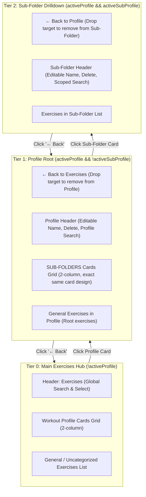

# UI Hierarchy & Design Symmetry Playbook
## *How to Methodically Refactor Nested UI Components to Match Existing Design Systems Without Mess, Regressions, or Confusion*

> **Target Audience:** Junior Software Engineers, Frontend Developers, and Pair Programmers learning how to refactor complex component views, maintain strict design symmetry, and implement multi-level hierarchical drilldowns methodically.

---

## 📑 Table of Contents
1. [The Challenge: "Make Feature X Look Exactly Like Page Y"](#1-the-challenge-make-feature-x-look-exactly-like-page-y)
2. [The Newbie Anti-Patterns vs. The Senior Method](#2-the-newbie-anti-patterns-vs-the-senior-method)
3. [The 3-Tier Hierarchical Mental Model (Visual Architecture)](#3-the-3-tier-hierarchical-mental-model-visual-architecture)
4. [Step-by-Step Implementation Flow (The Exact Sequence)](#4-step-by-step-implementation-flow-the-exact-sequence)
   - [Step 1: Symmetry in Data Derivation (`useMemo` Cards)](#step-1-symmetry-in-data-derivation-usememo-cards)
   - [Step 2: Scoping Search & Exercise Filtering Across Tiers](#step-2-scoping-search--exercise-filtering-across-tiers)
   - [Step 3: View Orchestration & Drilldown Routing (FSM Architecture)](#step-3-view-orchestration--drilldown-routing-fsm-architecture)
   - [Step 4: Card Component Symmetrization (Design Tokens & Ergonomics)](#step-4-card-component-symmetrization-design-tokens--ergonomics)
   - [Step 5: Drag-and-Drop Drop-Target Matrix (Desktop & Mobile Parity)](#step-5-drag-and-drop-drop-target-matrix-desktop--mobile-parity)
   - [Step 6: Contextual Bulk Actions Bar](#step-6-contextual-bulk-actions-bar)
   - [Step 7: Verification & Preventing JSX Breakage](#step-7-verification--preventing-jsx-breakage)
5. [The Symmetrization Anatomy (Side-by-Side Code Blueprint)](#5-the-symmetrization-anatomy-side-by-side-code-blueprint)
6. [Universal Refactoring Checklist for Junior Engineers](#6-universal-refactoring-checklist-for-junior-engineers)
7. [Common Traps & How to Avoid Them](#7-common-traps--how-to-avoid-them)

---

## 1. The Challenge: "Make Feature X Look Exactly Like Page Y"

In commercial software development, an employer, product manager, or designer will frequently say:
> *"The sub-folder horizontal chip toolbar we built feels cramped and confusing. Redesign sub-folders so they look and behave the **exact same way** as workout profile cards on the front page. Keep it minimalistic, familiar, and clean."*

To a beginner, this sounds deceptively simple: *"Just change how it looks."*  
In reality, changing a component from a flat horizontal toolbar filter into a **hierarchical card grid with drilldown levels** changes:
1. **View states**: The screen now has 3 distinct depth levels instead of 2.
2. **Search scoping**: What does the search bar filter at each level?
3. **Drop targets**: When an exercise is dragged onto a card or a back button, where does it go?
4. **Lifecycle & cleanup**: When a user goes back, renames, or deletes a sub-folder, how does the UI reset?
5. **Mobile ergonomics**: Drag-and-drop on phones requires touch listeners, sticky trays, and 1-tap modal fallbacks.

If you don't tackle these systematically, you end up with broken JSX, mismatched styles, and orphaned states.

---

## 2. The Newbie Anti-Patterns vs. The Senior Method

### ❌ The Newbie Anti-Pattern: "Ad-hoc Copy-Paste & Fragmented State"
```
[1. Copy JSX from Front Page] ──> [2. Paste into Profile View] ──> [3. Variable names don't match]
                                                                            │
[6. Missing closing tags / broken build] <── [5. Nested ternaries hell] <── [4. Hack mismatched callbacks]
```
- **Copy-Pasting Blindly**: Copies card markup without understanding the underlying data structures (`profileCards` vs `subProfileCards`).
- **Inline Calculations in JSX**: Computes exercise counts and logs directly inside the JSX loop, causing performance lag.
- **Deeply Nested Ternaries**: Nesting `? ... : ? ... :` 4 levels deep in JSX, creating a nightmare to debug and guaranteed closing-brace syntax errors.
- **Inconsistent UX**: Card borders, hover effects, or padding differ slightly between the two pages, making the app feel cheap and unpolished.

---

### ✅ The Senior Method: "Data Symmetry & Finite State Drilldowns"
```
[1. Data Symmetry] ──> [2. Search Scoping] ──> [3. State Machine] ──> [4. Visual Tokens]
                                                                             │
[8. Verification] <── [7. Bulk Actions] <── [6. DND Matrix] <── [5. Drilldown View]
```
- **Symmetric Data Contracts**: If Level 0 has `profileCards: { name, totalLogs, uniqueExercises }[]`, Level 1 must have an identical `subProfileCards: { name, totalLogs, uniqueExercises }[]`.
- **Finite View Pyramid**: Explicitly define the views as distinct render blocks:
  - **Level 0 (Main Hub)**: `!activeProfile`
  - **Level 1 (Profile Root)**: `activeProfile && !activeSubProfile`
  - **Level 2 (Sub-Folder Drilldown)**: `activeProfile && activeSubProfile`
- **Reversible Interactions**: Every action (entering a folder, dragging an item in) has an equal and opposite action (back button, dragging an item out).
- **Compile-First Discipline**: Validating TypeScript after each logical layer before moving to the next.

---

## 3. The 3-Tier Hierarchical Mental Model (Visual Architecture)



### The Drop-Target Matrix
| Drilldown Tier | Dragged Item | Drop Target | Resulting Mutation |
| :--- | :--- | :--- | :--- |
| **Tier 0 (Front Page)** | Any Exercise | Profile Card `[X]` | `onBulkUpdateExerciseProfile([item], "X")` |
| **Tier 1 (Profile Root)** | Profile Exercise | Sub-Folder Card `[Y]` | `onUpdateExerciseSubProfile(item, activeProfile, "Y")` |
| **Tier 1 (Profile Root)** | Profile Exercise | `← Back to Exercises` Button | `onBulkUpdateExerciseProfile([item], null)` *(Moves to General)* |
| **Tier 2 (Sub-Folder)** | Sub-Folder Exercise | `← Back to {Profile}` Button | `onUpdateExerciseSubProfile(item, activeProfile, null)` *(Reverts to Profile Root)* |

---

## 4. Step-by-Step Implementation Flow (The Exact Sequence)

When refactoring a UI to mirror an existing page, follow this exact 7-step sequence:

### Step 1: Symmetry in Data Derivation (`useMemo` Cards)
Before writing any card HTML, build the memoized data structure that feeds the grid.  
Notice how `subProfileCards` is engineered to have the exact same shape as `profileCards`:

```typescript
// FRONT PAGE DATA SHAPE
const profileCards = useMemo(() => {
  // maps over profiles -> { name, totalLogs, uniqueExercises }
}, [profiles, workouts]);

// SUB-FOLDER DATA SHAPE (SYMMETRIC MIRROR)
const subProfileCards = useMemo(() => {
  if (!activeProfile) return [];
  const subMap = new Map<string, { count: number; exerciseSet: Set<string> }>();

  // 1. Seed with known sub-profiles (so empty folders render too!)
  currentSubProfiles.forEach((s) => {
    subMap.set(s, { count: 0, exerciseSet: new Set() });
  });

  // 2. Aggregate logs and unique exercise names
  activeProfileWorkouts.forEach((w) => {
    if (w.sub_profile) {
      if (!subMap.has(w.sub_profile)) {
        subMap.set(w.sub_profile, { count: 0, exerciseSet: new Set() });
      }
      const entry = subMap.get(w.sub_profile)!;
      entry.count++;
      entry.exerciseSet.add(w.exercise);
    }
  });

  // 3. Return normalized card array
  return Array.from(subMap.entries()).map(([name, data]) => ({
    name,
    totalLogs: data.count,
    uniqueExercises: data.exerciseSet.size,
  }));
}, [activeProfile, currentSubProfiles, activeProfileWorkouts]);
```

> 💡 **Junior Tip:** Seeding the `subMap` with `currentSubProfiles` ensures that **newly created, empty folders still show up as cards**. If you only aggregate from workouts, an empty folder would instantly disappear!

---

### Step 2: Scoping Search & Exercise Filtering Across Tiers
A major source of user confusion in multi-level apps is search ambiguity.  
Establish clean search semantics:
1. **Tier 0 (Front Page)**: If profiles exist, show uncategorized exercises; search filters across those uncategorized exercises.
2. **Tier 1 (Profile Root)**: Normal view shows exercises at the profile root (`sub_profile == null`). But if the user types into `searchQuery`, search across **all exercises in the profile** so they can find anything regardless of sub-folder.
3. **Tier 2 (Sub-Folder Drilldown)**: Filter strictly within the active sub-folder.

```typescript
const currentSummaries = useMemo(() => {
  if (activeProfile) {
    if (activeSubProfile) {
      // Tier 2: Only exercises inside this sub-folder
      const filtered = activeProfileWorkouts.filter(
        (w) => w.sub_profile?.toLowerCase() === activeSubProfile.toLowerCase()
      );
      return sortWithCustomOrder(groupExercises(filtered));
    }

    // Tier 1: Profile Root
    if (searchQuery.trim()) {
      // Searching at root searches across the ENTIRE profile
      return sortWithCustomOrder(groupExercises(activeProfileWorkouts));
    }

    // Default at root: show exercises directly in profile (no sub-folder)
    const rootExercises = activeProfileWorkouts.filter((w) => !w.sub_profile);
    return sortWithCustomOrder(groupExercises(rootExercises));
  }

  // Tier 0: Main Page
  const list = profileCards.length > 0 ? uncategorizedWorkouts : workouts;
  return sortWithCustomOrder(groupExercises(list));
}, [activeProfile, activeSubProfile, activeProfileWorkouts, searchQuery, profileCards.length, uncategorizedWorkouts, workouts, customOrder]);
```

---

### Step 3: View Orchestration & Drilldown Routing (FSM Architecture)
Instead of giant nested ternaries inside a single `return (...)`, use **early returns** to cleanly separate the views:

```typescript
// VIEW 1: INSIDE A WORKOUT PROFILE
if (activeProfile) {
  // SUB-VIEW 1B: DRILLDOWN INTO A SUB-FOLDER (Tier 2)
  if (activeSubProfile) {
    return (
      <div className="drilldown-subprofile">
        {/* Back Button -> setActiveSubProfile(null) */}
        {/* Sub-Folder Header (Rename & Delete) */}
        {/* Exercises in Sub-Folder */}
      </div>
    );
  }

  // SUB-VIEW 1A: PROFILE ROOT (Tier 1)
  return (
    <div className="profile-root">
      {/* Back Button -> setActiveProfile(null) */}
      {/* Profile Header (Rename & Delete Profile) */}
      {/* Sub-Folders Cards Grid (Mirrors Front Page) */}
      {/* General Exercises List */}
    </div>
  );
}

// VIEW 2: GLOBAL EXERCISE HUB (Tier 0)
return (
  <div className="global-hub">
    {/* Global Header */}
    {/* Workout Profiles Cards Grid */}
    {/* General Exercises List */}
  </div>
);
```
**Why this matters:**
- Eliminates 90% of JSX syntax errors and closing-tag confusion.
- Gives each view its own layout logic without polluting peer views.
- Makes the code immediately readable to any engineer joining the team.

---

### Step 4: Card Component Symmetrization (Design Tokens & Ergonomics)
To achieve true design symmetry, every visual token on the sub-folder card must match the profile card:

| Element | Exact Tailwind Tokens | Why It Matters |
| :--- | :--- | :--- |
| **Card Container** | `p-5 rounded-2xl bg-[#252320]/80 border border-[#383530] hover:border-[#CC6543] hover:bg-[#252320] transition-all group flex items-center justify-between` | Identical physical dimensions, roundedness, and hover response |
| **Folder Icon Badge** | `w-10 h-10 rounded-xl bg-[#CC6543]/15 text-[#CC6543] group-hover:bg-[#CC6543] group-hover:text-white flex items-center justify-center shrink-0` | Color resonance and familiar anchor icon |
| **Primary Title** | `text-xl font-bold text-[#F5F2EB] group-hover:text-[#DE7C5A] truncate` | Consistent typographic hierarchy |
| **Metadata Subtitle** | `text-xs text-[#A8A297] mt-0.5` (`{X} exercises · {Y} sessions`) | Predictable information density |
| **Inline Actions** | Rename `Pencil` + Delete `Trash2` with affirmative `Delete? Yes / No` badge | Consistent interactive affordance |
| **Directional Arrow** | `w-8 h-8 rounded-full border border-[#383530] group-hover:border-[#CC6543] group-hover:bg-[#CC6543]/10` | Universal cue that clicking drills into the folder |

---

### Step 5: Drag-and-Drop Drop-Target Matrix (Desktop & Mobile Parity)
Every card in the grid must be both a **clickable link** and an **HTML5 drag-and-drop drop target**:

```tsx
<div
  key={sub.name}
  data-subprofile-drop={sub.name} // Mobile touch coordinate detection
  onDragOver={(e) => {
    e.preventDefault();
    e.dataTransfer.dropEffect = 'move';
    if (dragOverSubProfile !== sub.name) setDragOverSubProfile(sub.name);
  }}
  onDragLeave={(e) => {
    if (e.currentTarget.contains(e.relatedTarget as Node)) return;
    if (dragOverSubProfile === sub.name) setDragOverSubProfile(null);
  }}
  onDrop={async (e) => {
    e.preventDefault();
    const exerciseName = e.dataTransfer.getData('text/plain') || draggingExercise;
    if (exerciseName && onUpdateExerciseSubProfile && activeProfile) {
      await onUpdateExerciseSubProfile(exerciseName, activeProfile, sub.name);
      setDragFeedbackMessage(`Moved "${exerciseName}" into "${sub.name}"`);
    }
    setDraggingExercise(null);
    setDragOverSubProfile(null);
  }}
  onClick={() => {
    if (draggingExercise) return;
    setActiveSubProfile(sub.name); // Drill into Tier 2
  }}
  className={/* dynamic border/scale highlight when isOverThis */}
>
```

#### Dual-Purpose Back Buttons
Notice how the back button acts as both a navigation trigger AND a drop target to move an exercise back up one tier:
```tsx
<button
  onClick={() => setActiveSubProfile(null)}
  data-subprofile-drop="__none__"
  onDragOver={(e) => {
    e.preventDefault();
    setDragOverSubProfile('__none__');
  }}
  onDrop={async (e) => {
    e.preventDefault();
    if (draggingExercise && onUpdateExerciseSubProfile && activeProfile) {
      await onUpdateExerciseSubProfile(draggingExercise, activeProfile, null);
      setDragFeedbackMessage(`Removed "${draggingExercise}" from "${activeSubProfile}"`);
    }
    setDraggingExercise(null);
  }}
>
  <ArrowLeft className="w-4 h-4" />
  <span>{draggingExercise ? `📥 Drop here to move back to ${activeProfile}` : `Back to ${activeProfile}`}</span>
</button>
```

---

### Step 6: Contextual Bulk Actions Bar
When the user enters selection mode (`isSelecting = true`), the floating action bar dynamically changes its capabilities based on the active tier:
- At **Tier 0**: Option to bulk move selected exercises into a **Workout Profile**.
- At **Tier 1 & 2**: Option to bulk move selected exercises into a **Sub-Folder** within the current profile, plus an inline sub-folder creator.

---

### Step 7: Verification & Preventing JSX Breakage
When refactoring large components (1,000+ lines), JSX syntax errors are the #1 source of wasted engineering hours. Follow these protective rules:
1. **Never delete both opening and closing tags in one huge replacement**: Target discrete sections.
2. **Verify after every view extraction**: Run `npm run build` (`tsc -b && vite build`) immediately after editing each view block.
3. **Use Git Diff as a mirror check**: Run `git diff -U3` to ensure that lines above and below your edit block remained untouched.

---

## 5. The Symmetrization Anatomy (Side-by-Side Code Blueprint)

| Feature | Front Page (Workout Profiles) | Profile Root (Sub-Folders) |
| :--- | :--- | :--- |
| **Grid Class** | `grid grid-cols-1 sm:grid-cols-2 gap-4` | `grid grid-cols-1 sm:grid-cols-2 gap-4` |
| **Card Key** | `p` (Profile Name) | `sub.name` (Sub-Folder Name) |
| **Data Attribute** | `data-profile-drop={p}` | `data-subprofile-drop={sub.name}` |
| **Primary Icon** | `<Folder className="w-5 h-5 text-[#CC6543]" />` | `<Folder className="w-5 h-5 text-[#CC6543]" />` |
| **Rename Hook** | `handleStartRename(e, p)` | `handleStartRenameSubProfile(e, sub.name)` |
| **Delete Hook** | `handleDeleteProfileClick(e, p)` | `handleDeleteSubProfileClick(e, sub.name)` |
| **Count String** | `{card.uniqueExercises} exercises · {card.totalLogs} sessions` | `{sub.uniqueExercises} exercises · {sub.totalLogs} sessions` |
| **Drilldown Action** | `setActiveProfile(p)` | `setActiveSubProfile(sub.name)` |

---

## 6. Universal Refactoring Checklist for Junior Engineers

Before opening a pull request for a UI hierarchy refactor, verify every box:

### Architectural Health
- [ ] **Data Symmetry**: Is card data derived in a clean `useMemo` with consistent keys (`name`, `totalLogs`, `uniqueExercises`)?
- [ ] **Empty State Resilience**: Do newly created empty sub-folders remain visible before workouts are added?
- [ ] **Finite View Separation**: Are Tier 0, Tier 1, and Tier 2 rendered in clean, distinct branches rather than nested ternaries?

### Interactions & Navigation
- [ ] **Drilldown Navigation**: Does clicking a card navigate smoothly into that sub-folder?
- [ ] **Back Navigation**: Does the back button return to the exact parent tier and reset selection/search states?
- [ ] **Search Scoping**: Does search filter within the expected scope at each tier?

### Drag-and-Drop Parity
- [ ] **Desktop DND**: Can exercises be dragged onto cards with clear highlight feedback?
- [ ] **Back Drop Target**: Can exercises be dragged onto the back button to move them out of a sub-folder?
- [ ] **Mobile Sticky Tray**: Does touch dragging on mobile summon the sticky drop tray?
- [ ] **Mobile 1-Tap Sheet**: Does clicking the `FolderPlus` icon on mobile open the 1-tap assignment sheet?

### Quality & Git
- [ ] **Zero TypeScript Errors**: Does `tsc -b && vite build` succeed with code 0?
- [ ] **Clean Diff**: Does `git diff` show only the intentional component modifications?

---

## 7. Common Traps & How to Avoid Them

### Trap 1: The "Vanishing Empty Folder"
- **Cause**: Computing card counts solely by iterating through existing workouts.
- **Symptom**: User clicks "+ New Sub-Folder", types "Leg Day", hits create... and nothing appears!
- **Fix**: Always seed your Map or Card array with the master list of known folders (`currentSubProfiles`) before iterating through workouts.

### Trap 2: Orphaned Child State
- **Cause**: Deleting a sub-folder while currently viewing it.
- **Symptom**: User deletes "Heavy Day" while inside it, leaving the view stuck in an invalid state.
- **Fix**: In the delete handler, check `if (activeSubProfile === subName) setActiveSubProfile(null)`.

### Trap 3: Search Traps
- **Cause**: Reusing the same search filter logic at every level.
- **Symptom**: Searching for an exercise at the profile root fails to find it because it is inside a sub-folder.
- **Fix**: Dynamically expand search scope at the profile root to search across all exercises in that profile.

---

*Authored for the NoPulse Gym Tracker Engineering Team · Written for clean architecture and junior engineer mentorship.*
